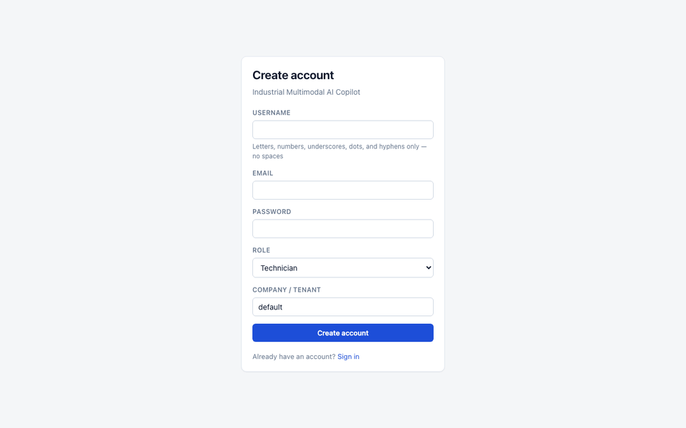
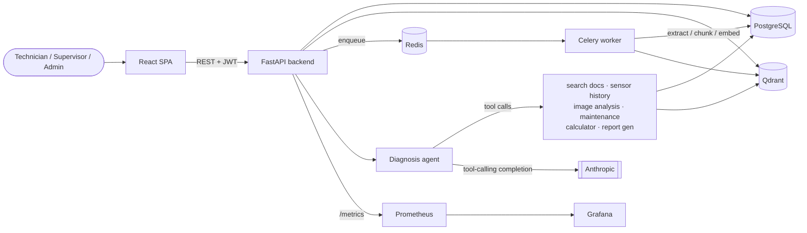

# Industrial Multimodal AI Copilot

Evidence-based diagnostic copilot for manufacturing technicians: combines a
technician's question, a component photo, sensor readings, and technical
manuals into a structured, cited diagnosis with confidence scoring and
human-in-the-loop approval for high-risk cases.

**Status: feature-complete (Phases 1–12 of the original build plan).**
Built incrementally, phase by phase, with every phase verified live
against real Postgres/Qdrant/Docker before moving to the next — not just
unit tests. See [`docs/architecture-decisions.md`](docs/architecture-decisions.md)
for the design rationale behind every non-obvious choice below, and
[`docs/security.md`](docs/security.md) for the security model
specifically.



*Real app, real backend, real data — registration, the dashboard, a live
document upload progressing through the real ingestion pipeline, and the
AI Copilot query form. Captured directly against the running stack, not
staged.*

## Why this exists

Most "AI chatbot" portfolio projects stop at RAG. This one is built
around a harder, more realistic brief: a technician asks a question, and
the system has to *go gather real evidence* — search manuals, pull
sensor history, look at a photo, check maintenance records — before it's
allowed to say anything, and even then a low-confidence or high-severity
conclusion has to go through a human before it's actionable. That
constraint shapes almost every design decision here: citations are
structurally validated against what was actually retrieved (never
trusted from model output), confidence is computed from evidence
signals rather than self-reported by the model, and every phase's
completion was verified against real infrastructure, not asserted.

**What it demonstrates, concretely:**
- Hybrid RAG (dense + BM25 + reranking) with citations that can't be
  fabricated by construction, not just by instruction
- An agentic tool-calling loop (7 tools) with deterministic confidence
  scoring and a full test suite that exercises the control flow via a
  scripted model, independent of API availability
- Multimodal input (vision + structured sensor time-series) feeding one
  evidence pipeline
- Human-in-the-loop approval as a first-class workflow, not a bolt-on
- Production-adjacent infra: Prometheus/Grafana observability, an
  evaluation harness with real measured metrics (not asserted ones), and
  CI across backend/frontend/Docker

<details>
<summary><strong>Contents</strong></summary>

- [Architecture](#architecture)
- [Stack](#stack)
- [Local setup](#local-setup)
- [Running tests](#running-tests)
- [Usage guide](#usage-guide) — migrations, evaluation harnesses, and a
  curl-driven tour of every pipeline, in `docs/usage-guide.md`
- [Implementation log](#implementation-log) — full build-out, in
  `docs/implementation-log.md`
- [Possible next steps](#possible-next-steps)
- [Known limitations](#known-limitations)

</details>

## Architecture



Request flow for a diagnosis: the frontend calls `POST /copilot/query`
with a JWT; the backend hands the question to the diagnosis agent, which
decides which tools it needs (it doesn't call all seven on every
request); each tool call is scoped to the caller's own tenant and
returns real citations from Postgres/Qdrant; the agent's final answer is
validated against those citations before being persisted — anything it
claims that isn't backed by a real tool result is dropped, not shown.
See [`docs/usage-guide.md`](docs/usage-guide.md#try-the-diagnosis-agent) to
run this end to end.

## Stack

- **Backend**: FastAPI, SQLAlchemy (async), Alembic, PostgreSQL
- **Ingestion**: pdfplumber (structure-aware extraction), Tesseract OCR
  fallback for scanned pages, Celery + Redis for async processing
- **Retrieval**: Qdrant (dense) + BM25 (lexical) hybrid search with
  Reciprocal Rank Fusion, cross-encoder reranking, all local models
- **AI providers**: configurable — Anthropic Claude by default, no dependency
  on a paid OpenAI key for local development (also supports Ollama/any
  OpenAI-compatible server via `LLM_BASE_URL`)
- **Vision**: configurable VLM (Anthropic/OpenAI) for structured visual
  observations with confidence + explicit uncertainty
- **Sensor analytics**: trend detection, statistical + ML-based (Isolation
  Forest) anomaly detection, baseline comparison — `numpy`/`scikit-learn`
- **Diagnosis agent**: Claude tool-use loop over 7 tools (search manuals,
  sensor history, image analysis, maintenance schedule, safe calculator,
  report generation), deterministic confidence scoring, structural
  citation validation across all evidence types
- **Human-in-the-loop**: role-gated supervisor approve/reject workflow,
  append-only audit log
- **Frontend**: React 19 + Vite + TypeScript, hand-rolled CSS design
  system, role-aware SPA (Dashboard, Knowledge Base, AI Copilot, Evidence
  panel, Approval Dashboard, Audit Log)
- **Observability**: Prometheus metrics (HTTP, LLM/VLM calls + token usage,
  agent tool calls, diagnoses, approvals) + Grafana dashboard, on top of
  structured logging (structlog)
- **Infra**: Docker Compose

## Local setup

```bash
cp .env.example .env   # then set ANTHROPIC_API_KEY if you want live LLM calls
docker compose up --build
```

No budget for API credits? Set `LLM_PROVIDER=openai`, `LLM_MODEL=llama3.2:3b`,
`LLM_BASE_URL=http://host.docker.internal:11434/v1` and run a local
[Ollama](https://ollama.com) server instead — no key, no cost. The diagnosis
agent's tool-calling loop runs end-to-end against it; see the tool-calling
caveat under Known limitations for what's different about that path.

- API docs: http://localhost:8000/docs
- Health check: http://localhost:8000/api/v1/health

## Running tests

```bash
make test        # the full suite (mocked/deterministic — no API key needed), run inside the backend container
make test-live   # live smoke tests against a real Anthropic API — needs ANTHROPIC_API_KEY, skips cleanly without one
```

`make test` includes unit tests, real-Docker-infra integration tests
(Postgres/Qdrant), and the mocked AI-pipeline tests (VLM, agent tool-loop,
full end-to-end diagnosis pipeline) — all deterministic, none needing a
paid API key. The two tests under `tests/live/` are the only ones that
make a real, billed provider call; they run as part of `make test` too but
report **SKIPPED** (not passed) without `ANTHROPIC_API_KEY` — a skipped
run can never be mistaken for a verified one.

## Usage guide

Migrations, the retrieval/diagnosis evaluation harnesses, and a
curl-driven walkthrough of every pipeline (documents, sensors, the
diagnosis agent, approvals, the frontend, observability) live in
[`docs/usage-guide.md`](docs/usage-guide.md) — kept out of this README to
keep the overview scannable.

## Implementation log

Full build-out, area by area — what was built and how each was
verified — lives in
[`docs/implementation-log.md`](docs/implementation-log.md): Foundation,
Document Intelligence, RAG, Vision, Sensor Intelligence, Diagnosis Agent,
Human Approval, Frontend, Observability, Evaluation, CI/CD, Final Polish.

## Possible next steps

Everything in the original 12-phase build plan is complete. Genuine
extensions this project could reasonably grow into, not commitments:

- Streaming the diagnosis agent's progress to the frontend (SSE/WebSocket)
  instead of one request/response round trip, so a technician sees
  "checking sensor history…" rather than a blank wait
- Multi-turn refinement of an existing diagnosis (the `Conversation` model
  already supports follow-up messages; the agent loop doesn't yet reuse
  prior evidence when a technician asks a clarifying follow-up)
- Kubernetes manifests alongside the current Docker Compose setup, for a
  more realistic path to a multi-node deployment
- A real LLM-as-judge evaluation pass once there's an API budget to
  verify a judge model's own reliability against — deliberately not
  attempted in Phase 10 without that (see the ADR entry on why)

## Known limitations

- Structure detection is a font-size heuristic, not a layout ML model — it
  works well on manuals with consistent heading styles but can misdetect
  structure in inconsistently formatted documents. OCR'd pages have no font
  metadata at all, so heading detection there falls back to a weaker
  text-pattern heuristic (numbered/ALL-CAPS headings).
- BM25 is recomputed per query over the tenant-scoped candidate set fetched
  from Postgres rather than a persistent index — fine at portfolio scale,
  documented as a scaling limitation in the ADR.
- **Claude/Anthropic path not live-verified**: no Anthropic API credits are
  configured in this environment, so Claude-specific agent reasoning, VLM
  accuracy, and diagnosis evaluation have never been exercised end-to-end
  against Claude here — no accuracy claim is made for that path without it.
  The diagnosis agent's tool-calling loop *has* been live-verified
  end-to-end against a free local model instead (Ollama, `llama3.2:3b`, via
  `LLM_PROVIDER=openai` + `LLM_BASE_URL`) — real HTTP requests, real tool
  calls confirmed via the `agent_tool_calls_total` Prometheus counter, real
  evidence retrieved and cited, and unsupported model claims genuinely
  caught and discarded by the citation validator. See
  [`docs/usage-guide.md`](docs/usage-guide.md) and Running tests above for
  the deterministic (non-live) coverage; the live smoke tests and
  evaluation harness will run for real against Claude the moment
  `ANTHROPIC_API_KEY` is set.
- No local VLM option (Qwen-VL/LLaVA) — the provider abstraction supports
  adding one, but it wasn't built this phase, so vision analysis stays
  unverified regardless of which LLM provider is used for text.
- Tool-calling supports both `LLM_PROVIDER=anthropic` and
  `LLM_PROVIDER=openai` (including any OpenAI-compatible server via
  `LLM_BASE_URL`, e.g. local Ollama — see Local setup above). A 3B local
  model selects the right tools but grounds its final answer in retrieved
  evidence less reliably than Claude does in practice; the structural
  citation validator strips any citation that doesn't match real tool
  output, so this shows up as fewer supported claims per answer rather than
  a fabricated citation slipping through.
- Prometheus/Grafana observability covers the FastAPI backend (HTTP,
  LLM/VLM, agent, diagnosis, approval metrics) and the Celery worker (task
  counts/durations via a second scrape target,
  `observability/prometheus/prometheus.yml`).
- LLM/VLM cost tracking (`llm_cost_usd_total`) stays at zero unless you
  configure your own current provider rate — no price is hard-coded; token
  *counts* are always tracked from the provider's real usage response.

See [`docs/architecture-decisions.md`](docs/architecture-decisions.md) for
the reasoning behind each of these.
