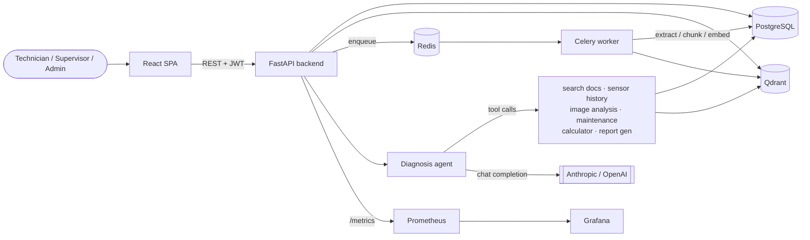

# Industrial Multimodal AI Copilot

Evidence-based diagnostic copilot for manufacturing technicians: combines a
technician's question, a component photo, sensor readings, and technical
manuals into a structured, cited diagnosis with confidence scoring and
human-in-the-loop approval for high-risk cases.

**Status: feature-complete (Phases 1–12 of the original build plan).**
Built incrementally, phase by phase, with every phase verified live
against real Postgres/Qdrant/Docker before moving to the next — not just
unit tests. See [`docs/architecture-decisions.md`](docs/architecture-decisions.md)
for the design rationale behind every non-obvious choice below, and
[`docs/security.md`](docs/security.md) for the security model
specifically.

## Why this exists

Most "AI chatbot" portfolio projects stop at RAG. This one is built
around a harder, more realistic brief: a technician asks a question, and
the system has to *go gather real evidence* — search manuals, pull
sensor history, look at a photo, check maintenance records — before it's
allowed to say anything, and even then a low-confidence or high-severity
conclusion has to go through a human before it's actionable. That
constraint shapes almost every design decision here: citations are
structurally validated against what was actually retrieved (never
trusted from model output), confidence is computed from evidence
signals rather than self-reported by the model, and every phase's
completion was verified against real infrastructure, not asserted.

**What it demonstrates, concretely:**
- Hybrid RAG (dense + BM25 + reranking) with citations that can't be
  fabricated by construction, not just by instruction
- An agentic tool-calling loop (7 tools) with deterministic confidence
  scoring and a full test suite that exercises the control flow via a
  scripted model, independent of API availability
- Multimodal input (vision + structured sensor time-series) feeding one
  evidence pipeline
- Human-in-the-loop approval as a first-class workflow, not a bolt-on
- Production-adjacent infra: Prometheus/Grafana observability, an
  evaluation harness with real measured metrics (not asserted ones), and
  CI across backend/frontend/Docker

<details>
<summary><strong>Contents</strong></summary>

- [Architecture](#architecture)
- [Stack](#stack)
- [Local setup](#local-setup)
- [Running tests](#running-tests)
- [Migrations](#migrations)
- [Retrieval evaluation](#retrieval-evaluation)
- [Diagnosis agent evaluation](#diagnosis-agent-evaluation)
- [Try the document pipeline](#try-the-document-pipeline)
- [Try the sensor pipeline](#try-the-sensor-pipeline)
- [Try the diagnosis agent](#try-the-diagnosis-agent)
- [Try the approval workflow](#try-the-approval-workflow)
- [Try the frontend](#try-the-frontend)
- [Try observability](#try-observability)
- [Implemented so far](#implemented-so-far) (phase-by-phase build log)
- [Possible next steps](#possible-next-steps)
- [Known limitations](#known-limitations)

</details>

## Architecture



Request flow for a diagnosis: the frontend calls `POST /copilot/query`
with a JWT; the backend hands the question to the diagnosis agent, which
decides which tools it needs (it doesn't call all seven on every
request); each tool call is scoped to the caller's own tenant and
returns real citations from Postgres/Qdrant; the agent's final answer is
validated against those citations before being persisted — anything it
claims that isn't backed by a real tool result is dropped, not shown.
See [Try the diagnosis agent](#try-the-diagnosis-agent) below to run this
end to end.

## Stack

- **Backend**: FastAPI, SQLAlchemy (async), Alembic, PostgreSQL
- **Ingestion**: pdfplumber (structure-aware extraction), Tesseract OCR
  fallback for scanned pages, Celery + Redis for async processing
- **Retrieval**: Qdrant (dense) + BM25 (lexical) hybrid search with
  Reciprocal Rank Fusion, cross-encoder reranking, all local models
- **AI providers**: configurable — Anthropic Claude by default, no dependency
  on a paid OpenAI key for local development (also supports Ollama/any
  OpenAI-compatible server via `LLM_BASE_URL`)
- **Vision**: configurable VLM (Anthropic/OpenAI) for structured visual
  observations with confidence + explicit uncertainty
- **Sensor analytics**: trend detection, statistical + ML-based (Isolation
  Forest) anomaly detection, baseline comparison — `numpy`/`scikit-learn`
- **Diagnosis agent**: Claude tool-use loop over 7 tools (search manuals,
  sensor history, image analysis, maintenance schedule, safe calculator,
  report generation), deterministic confidence scoring, structural
  citation validation across all evidence types
- **Human-in-the-loop**: role-gated supervisor approve/reject workflow,
  append-only audit log
- **Frontend**: React 19 + Vite + TypeScript, hand-rolled CSS design
  system, role-aware SPA (Dashboard, Knowledge Base, AI Copilot, Evidence
  panel, Approval Dashboard, Audit Log)
- **Observability**: Prometheus metrics (HTTP, LLM/VLM calls + token usage,
  agent tool calls, diagnoses, approvals) + Grafana dashboard, on top of
  structured logging (structlog)
- **Infra**: Docker Compose

## Local setup

```bash
cp .env.example .env   # then set ANTHROPIC_API_KEY if you want live LLM calls
docker compose up --build
```

- API docs: http://localhost:8000/docs
- Health check: http://localhost:8000/api/v1/health

## Running tests

```bash
make test    # unit tests, run inside the backend container
```

## Migrations

```bash
make migrate              # apply migrations
make revision m="message" # generate a new migration from model changes
```

## Retrieval evaluation

```bash
make eval    # python -m evaluation.run, inside the backend container
```

Runs a 7-question ground-truth set (`data/evaluation/rag_questions.json`)
through the real hybrid retrieval pipeline against live Postgres+Qdrant and
prints/saves actual measured Recall@K, Precision@K, MRR, and nDCG@5 — no
metric here is hard-coded. Self-contained: indexes the synthetic sample
manual automatically on first run if it isn't already there. Current
measured result: **MRR 0.886, Recall@5 1.0, Recall@3 0.857** (one query — a
paraphrase, "hot to the touch" for "overheating" — ranks the correct chunk
at position 5 rather than top-3, a genuine retrieval limitation, not
smoothed over).

## Diagnosis agent evaluation

```bash
make eval-diagnosis    # python -m evaluation.diagnosis_eval, inside the backend container
```

Runs a 5-scenario labeled set (`data/evaluation/diagnosis_scenarios.json`)
through the real diagnosis agent loop against live Postgres/Qdrant, using
the same self-seeded `evaluation` tenant as retrieval evaluation above
(manual + seeded sensor history + seeded equipment/maintenance data — all
idempotent, no manual setup). For each scenario it measures **tool
recall** (did the agent call the tools a competent diagnostician needs for
this question, against a hand-labeled expectation), **evidence-type
coverage**, **citation validity rate** (fraction of causes with real
supporting evidence — the citations themselves are already guaranteed
non-fabricated by the agent loop's own validation, Phase 6), and whether
severity met a deterministically-grounded floor where one applies (e.g.
the seeded MOTOR-001 vibration anomalies should force at least "medium").
Deliberately does **not** attempt an LLM-as-judge quality score on the
diagnosis text — see `docs/architecture-decisions.md` for why that would
be exactly the kind of unverified metric this project avoids elsewhere.

**Requires `ANTHROPIC_API_KEY`** — unlike retrieval evaluation, there's no
local stand-in for the agent's own reasoning, so this exits cleanly with a
message rather than running (and never fabricates a report) if no key is
configured — which is the case in this project's own development
environment; see Known limitations.

## Try the document pipeline

```bash
docker compose run --rm backend python scripts/generate_sample_manual.py
```

generates a synthetic electric-motor manual at `data/manuals/electric_motor_manual.pdf`
(original content, not copied from any real manufacturer). Upload it:

```bash
TOKEN=$(curl -s -X POST localhost:8000/api/v1/auth/register \
  -H "Content-Type: application/json" \
  -d '{"username":"tech1","email":"tech1@example.com","password":"correct-horse-battery","tenant_id":"acme"}' \
  | python3 -c "import sys,json;print(json.load(sys.stdin)['access_token'])")

curl -X POST localhost:8000/api/v1/documents/upload \
  -H "Authorization: Bearer $TOKEN" \
  -F "file=@data/manuals/electric_motor_manual.pdf;type=application/pdf" \
  -F "equipment_type=electric_motor" -F "equipment_id=MOTOR-001"
```

Poll `GET /api/v1/documents/{id}` — status moves through
`uploaded -> processing -> extracting -> (ocr) -> chunking -> embedding ->
indexing -> ready`, ending with real chunks in Postgres and Qdrant, each
tagged with its section/subsection (e.g. "Troubleshooting > Unusual noise"),
page number, and equipment metadata.

## Try the sensor pipeline

```bash
docker compose run --rm backend python scripts/seed_sensor_data.py acme
```

Generates synthetic hourly sensor CSVs (`data/sensors/*.csv`, 14 days) and
loads them for tenant `acme`. `motor_001` tells a deliberate story tied to
the sample manual: temperature drifts upward over the last 2 days
(developing overheating) and vibration gets 5 injected spikes crossing the
manual's stated 4.5 mm/s guidance. Then, as any user registered in `acme`:

```bash
curl "localhost:8000/api/v1/sensors/MOTOR-001/analysis?metric=temperature&start_time=2026-08-09T00:00:00Z&end_time=2026-08-23T00:00:00Z" \
  -H "Authorization: Bearer $TOKEN"
```

returns real trend direction/slope, statistical anomalies, threshold
violations (with the manual citation attached), and baseline comparison —
all computed from the actual seeded data, not canned.

## Try the diagnosis agent

```bash
docker compose run --rm backend python scripts/seed_equipment_data.py acme
```

Seeds `Equipment` + `MaintenanceTask` rows for MOTOR-001/PUMP-001/CONVEYOR-001
(some deliberately overdue). Then:

```bash
curl -X POST localhost:8000/api/v1/copilot/query \
  -H "Authorization: Bearer $TOKEN" -H "Content-Type: application/json" \
  -d '{"question":"Why is MOTOR-001 vibrating excessively?","equipment_id":"MOTOR-001","equipment_type":"electric_motor"}'
```

drives the full pipeline: creates a conversation, runs the tool-calling
agent loop (search manuals / sensor history / maintenance schedule / image
analysis / calculator as needed), computes confidence deterministically
from what evidence was actually gathered, and returns a structured
diagnosis. Without `ANTHROPIC_API_KEY` configured this returns a `200` with
`status: "failed"` and a clear `error_message` rather than a crash — see
Known limitations.

## Try the approval workflow

```bash
# as a supervisor or admin registered in the same tenant as the diagnosis:
curl -X POST localhost:8000/api/v1/diagnoses/$DIAGNOSIS_ID/approve \
  -H "Authorization: Bearer $SUPERVISOR_TOKEN" -H "Content-Type: application/json" \
  -d '{"comments":"Confirmed via evidence review."}'
```

`GET /api/v1/diagnoses?pending_approval=true` lists diagnoses that need a
decision (completed, flagged `requires_human_approval`, not yet decided).
A decision, once made, can't be re-decided (`409` on a second attempt) —
disagreements go through a fresh question, not mutated history. Admins can
review the full audit trail: `GET /api/v1/audit-logs`.

## Try the frontend

```bash
docker compose up --build frontend
```

Open http://localhost:3002 — register (or log in), then:

- **Dashboard** — diagnosis/document/approval stats at a glance
- **Knowledge Base** — upload a manual, watch its status poll live through
  the ingestion pipeline
- **AI Copilot** — ask a question, optionally attach a component photo and
  current sensor readings, get back a structured, cited diagnosis
- **Approvals** (supervisor/admin) — approve/reject diagnoses flagged
  `requires_human_approval`
- **Audit Log** (admin) — the full compliance event trail

Role-based UI gating (nav items hidden, routes redirect) mirrors the
backend's RBAC — the frontend check is a UX courtesy, the backend
`require_roles` check is the real enforcement (see ADR). For local frontend
development with hot reload instead of the Docker build:

```bash
cd frontend && npm install && npm run dev
```

## Try observability

```bash
docker compose up --build backend prometheus grafana
```

- **Raw metrics**: http://localhost:8000/metrics (Prometheus text format —
  unauthenticated by design, see ADR)
- **Prometheus**: http://localhost:9091 — confirm the scrape target is
  `up` under Status > Targets, or run a query like `diagnoses_total`
- **Grafana**: http://localhost:3003 (login `admin`/`admin`, or browse
  anonymously — read-only viewer access is enabled for local convenience)
  → Dashboards → "Industrial Copilot", pre-provisioned with panels for
  HTTP request rate/latency, LLM/VLM call rate/latency/token usage, agent
  tool-call rate, diagnoses created, confidence distribution, and approval
  decisions

Every panel is wired to real, currently-empty-or-populated data, not a
mock — the HTTP panels populate immediately from normal API traffic; the
LLM/VLM panels show "No data" until a real Anthropic call succeeds (see
Known limitations), and the diagnosis/approval panels populate as soon as
you run the copilot/approval flows above. Confirmed end-to-end this
phase: a real `copilot/query` request (failing cleanly on the
no-API-key path) shows up in `diagnoses_total` within one scrape
interval.

## Implemented so far

**Phase 1 — Foundation**
- Configuration via Pydantic Settings (`app/config.py`), no hard-coded secrets
- Async SQLAlchemy engine + session management, Alembic migrations
- Structured JSON logging with per-request context (`app/logging_config.py`)
- User model + role-based auth (technician / supervisor / admin): register,
  login, JWT bearer tokens, password hashing (bcrypt)
- Rate limiting (slowapi), CORS, security headers, request-ID propagation
- Health check endpoint with a live database check
- Dockerized backend + Postgres + Qdrant with health checks

**Phase 2 — Document Intelligence**
- `Document` / `DocumentVersion` / `DocumentChunk` models with real document
  versioning (re-upload supersedes without losing history)
- Tenant-scoped isolation (`tenant_id` on `User`/`Document`) — manuals are
  shared within a company, never leaked across tenants; covered by tests
- PDF upload with MIME + magic-byte validation, size limits, safe on-disk
  storage
- Structure-aware extraction (pdfplumber font-size heading detection) —
  chunks split on heading boundaries first, not naive fixed-size windows
- OCR fallback (Tesseract + pdf2image) for scanned pages with no text layer
- Local embeddings (sentence-transformers) + Qdrant indexing, all async via
  Celery/Redis with a live status machine the frontend can poll
- Document list/detail/delete endpoints (delete cleans up DB rows, on-disk
  files, and Qdrant points)

**Phase 3 — RAG**
- Hybrid retrieval: dense (Qdrant) + BM25 (lexical, Postgres-scoped),
  combined with Reciprocal Rank Fusion (`app/rag/retrieval.py`)
- Cross-encoder reranking (local, `sentence-transformers` `CrossEncoder`)
- Metadata filtering (tenant always enforced; equipment type/ID, document,
  current-version-only optional) — verified live, including that a
  different tenant gets zero results from another tenant's manuals
- Grounded generation (`app/rag/generation.py`) with structural citation
  validation: the model cites by index into a numbered source list, so a
  citation is either a real retrieved chunk or flagged invalid and
  dropped — never a fabricated filename/page
- Configurable LLM provider (`app/llm/client.py`): Anthropic by default,
  OpenAI-compatible (incl. local Ollama) as a drop-in alternative
- Retrieval evaluation harness with real Recall@K/Precision@K/MRR/nDCG@K
  (`evaluation/run.py`, `make eval`)

**Phase 4 — Vision**
- Image validation via real decode (PIL), not just a trusted Content-Type
  header — rejects corrupt/non-image files
- Server-side re-encoding as a side effect that both strips EXIF metadata
  (privacy — phone photos often carry GPS) and downscales to a bounded size
- Configurable VLM provider (`app/vision/analyzer.py`): Anthropic or OpenAI,
  same provider-abstraction pattern as `app/llm/client.py`
- Structured output (observations with confidence, explicit limitations),
  never inventing measurements/temperatures/internal-component condition —
  enforced by the prompt *and* a structural post-hoc check
  (`_flag_suspected_measurements`) that scans the model's actual output for
  measurement-like patterns rather than only trusting the instruction
- `ImageAnalysis` model, tenant-isolated, synchronous request/response
  (single VLM call, no async pipeline needed)

**Phase 5 — Sensor Intelligence**
- `SensorReading` model: narrow/long schema (one row per metric per
  timestamp), maps directly onto the `query_sensor_history(equipment_id,
  metric, start_time, end_time)` tool signature the diagnosis agent
  (Phase 6) will use
- Snapshot ingestion (`POST /api/v1/sensors/upload`, JSON — matches the
  brief's real product flow) and historical CSV bulk-load via a seed
  script (`scripts/seed_sensor_data.py`)
- Analytics (`app/analytics/sensors.py`): trend detection (linear
  regression, reports "stable" rather than a direction when R² is too low
  to support one), statistical (z-score) anomaly detection as the default
  for explainability, Isolation Forest as an opt-in ML-based alternative,
  moving averages, baseline comparison against an equipment's own history
- Threshold checking against the one number the project's own synthetic
  manual actually states (vibration_rms > 4.5 mm/s) — no fabricated limits
  for metrics the manual doesn't address
- Live-verified against real seeded data: correctly detected the injected
  temperature drift as an "increasing" trend, flagged the elevated
  readings as statistical anomalies, caught all 5 injected vibration
  spikes via both detection methods, and confirmed tenant isolation

**Phase 6 — Diagnosis Agent**
- Single Claude tool-use agent, 7 tools (`app/tools/`) — not a multi-agent
  framework (see ADR)
- `Equipment` / `MaintenanceTask` / `Conversation` / `Message` / `Diagnosis`
  models — `Equipment` deferred since Phase 2 until this tool genuinely
  needed real per-equipment data (see ADR)
- Deterministic, rule-based confidence (`app/agents/confidence.py`) — never
  the model's self-reported number; live-verified to score <0.5 with no
  evidence and >0.5 once real evidence is gathered
- Citation validation extended to all evidence types (documents, sensor
  findings, image observations, maintenance records), not just documents —
  a cited string not matching real gathered evidence is dropped and
  flagged, never trusted
- Severity escalation floor: objective sensor anomaly evidence overrides a
  model claim of "low" severity to at least "medium"
- Safe arithmetic `calculate` tool — AST-restricted, not `eval()`
- The model-call step is injectable specifically so the loop's control
  flow (tool dispatch, citation validation, confidence/severity, failure
  handling, persistence) has real test coverage
  (`tests/test_diagnosis_agent.py`) despite no API key being available
- Live-verified against real Postgres/Qdrant/seeded data: full HTTP
  request → auth → orchestrator → clean-failure path; multi-tool
  orchestration (search + sensor history + maintenance schedule) against
  real Phase 2/3/5 data; a failed diagnosis still retains the evidence and
  tool calls gathered before the failure (a real gap found and fixed this
  phase, not assumed correct)

**Phase 7 — Human Approval**
- `Approval` model: one decision per diagnosis (`UniqueConstraint` on
  `diagnosis_id`) — approving/rejecting twice returns `409`, live-verified;
  disagreements go through a fresh question, not mutated history
- `POST /api/v1/diagnoses/{id}/approve` / `.../reject`, role-gated to
  supervisor/admin (`403` for technician, live-verified)
- `GET /api/v1/diagnoses?pending_approval=true` — completed, flagged
  `requires_human_approval`, not yet decided
- `AuditLog`: append-only event log covering the diagnosis lifecycle
  (created/failed/approved/rejected) and document lifecycle
  (uploaded/deleted); admin-only `GET /api/v1/audit-logs`
- Live-verified end-to-end through the real HTTP API: technician blocked,
  supervisor approves with comments, second decision attempt rejected with
  `409`, admin sees the approval event in the audit log, diagnosis drops
  out of the pending-approval list once decided

**Phase 8 — Frontend**
- React 19 + Vite + TypeScript SPA (`frontend/`), hand-rolled CSS design
  system (`src/index.css`) — no UI framework dependency (see ADR)
- Typed API client layer (`src/api/`) mirroring every backend Pydantic
  schema, JWT persisted client-side, `ApiError` surfaces real backend
  error details rather than a generic failure message
- Auth via React Context (`AuthContext`) — the one genuinely global piece
  of client state; everything else is server state fetched per-page
- Role-based UI gating (nav hidden + route-level `RequireRole` guards) for
  technician/supervisor/admin, layered on top of (not replacing) the
  backend's own RBAC enforcement — live-verified that a technician gets
  both the hidden nav item and a redirect, while the API still 403s
  independent of the UI
- Pages: Dashboard, Knowledge Base (upload + live-polling status), AI
  Copilot (question + optional image/sensor evidence), Evidence panel
  (integrated into the diagnosis view), Approval Dashboard, Diagnosis
  Detail, Audit Log, Login/Register
- Dockerized (multi-stage `node:20-alpine` build → `nginx:1.27-alpine`
  static serve), `VITE_API_BASE_URL` baked in at build time to the
  host-reachable backend URL, not the Docker-internal service name (see
  ADR)
- Live-verified in-browser across all pages/roles/flows (register, login,
  upload, query, approve, reject, navigate) with zero console errors,
  including the Dockerized build served on its own port with a real
  cross-origin request to the backend (no CORS failure, no mocked
  response)

**Phase 9 — Observability**
- Prometheus metrics (`app/observability/metrics.py`), scraped from a
  `/metrics` endpoint, deliberately unauthenticated (standard Prometheus
  practice — see ADR)
- HTTP metrics (`app/main.py`): request rate + duration, labeled by
  route *template* (`/api/v1/diagnoses/{diagnosis_id}`), not raw path —
  avoids unbounded label cardinality from UUIDs or scanned URLs
- LLM/VLM metrics (`app/llm/client.py`, `app/vision/analyzer.py`,
  `app/agents/diagnosis_agent.py`): call rate/status, latency, and real
  token counts from each provider's own `usage` field — one shared
  `record_llm_call()` helper across all three call sites (generation,
  vision, agent)
- Cost tracking is opt-in and config-driven
  (`ANTHROPIC_INPUT_COST_PER_1K_USD` etc., default `0.0`) rather than a
  hard-coded price table — this project's standing rule against
  presenting a fabricated number as real, applied to cost the same way
  it's applied to citations and measurements (see ADR)
- Agent tool-call metrics: rate/status/latency per tool
  (`app/agents/diagnosis_agent.py`), so a slow or failing tool in a
  multi-step diagnosis is visible, not just the end-to-end result
- Business metrics: `diagnoses_total` (status/severity),
  `diagnosis_confidence` (histogram), `approvals_total` (decision) —
  hooked into diagnosis creation/failure
  (`app/agents/diagnosis_agent.py`) and the single `_decide()` approval
  function (`app/services/approval_service.py`)
- Prometheus + Grafana containers (`docker-compose.yml`,
  `observability/`), Grafana pre-provisioned with a Prometheus datasource
  and a 9-panel starter dashboard — no manual setup required after
  `docker compose up`
- Scoped out this phase, documented as such: Celery worker/ingestion
  metrics (would need a multiprocess-safe registry — see ADR)
- Incidental fix found via `docker compose ps` while verifying this
  phase: the Phase 8 frontend container had been reporting `unhealthy`
  since it was built, despite serving correct traffic — its Dockerfile
  `HEALTHCHECK` used `wget http://localhost:3000/`, which resolves to
  `::1` first inside that image and fails, since nginx only binds IPv4.
  Fixed to check `127.0.0.1` directly (see ADR)
- 208 unit tests passing (7 new — HTTP metrics via the real endpoint,
  the `record_llm_call` helper incl. cost-calculation on/off, agent
  tool-call + diagnosis metrics via a scripted fake model, approval
  metrics), ruff clean
- Live-verified in Docker (not just unit tests): `/metrics` returns real
  data after real requests; Prometheus target shows `up` and its scraped
  values match the backend's own `/metrics` output exactly; the Grafana
  dashboard renders all 9 panels with no query errors — HTTP panels show
  real traffic immediately, LLM/agent panels correctly show "No data"
  (no fabricated placeholder values); a real `POST /copilot/query`
  request through the full HTTP stack (register → auth → agent →
  clean no-API-key failure) shows up in `diagnoses_total` end-to-end,
  from the Python counter through Prometheus's scrape to a live PromQL
  query, within one scrape interval

**Phase 10 — Evaluation**
- Diagnosis-agent evaluation harness (`evaluation/diagnosis_eval.py`,
  `make eval-diagnosis`), same self-contained/self-seeding pattern as
  Phase 3's retrieval harness, extended to a surface local models can't
  cover: the agent's own tool-selection and reasoning
- 5-scenario labeled ground-truth set
  (`data/evaluation/diagnosis_scenarios.json`) written directly against
  already-verified synthetic data from earlier phases (the Phase 5
  injected MOTOR-001 vibration spikes, the Phase 6 deliberately-overdue
  CONVEYOR-001 maintenance task) — no new fixtures invented for this
  phase
- Pure, unit-tested scoring functions
  (`app/evaluation/diagnosis_scoring.py`): tool recall, evidence-type
  coverage, citation validity rate, severity-floor check — all
  structural/deterministic, deliberately not an LLM-as-judge quality
  score (see ADR for why grading diagnosis prose with another
  unverified model call would undermine this project's own "never
  present a fabricated number as real" rule)
- Severity floor is only asserted where grounded in a rule the codebase
  already enforces deterministically (Phase 6's anomaly-driven
  escalation) — not a subjective judgment about the "right" diagnosis
- 222 unit tests passing (14 new: scoring functions), ruff clean
- Live-verified in Docker: the harness's missing-key path exits cleanly
  with a clear message rather than crashing or writing a fabricated
  report (confirmed — this environment has no `ANTHROPIC_API_KEY`, the
  same standing limitation carried since Phase 3); separately verified
  the full pipeline's wiring end-to-end (self-seeding against real
  Postgres, real `run_diagnosis` persistence, scoring against real
  `Diagnosis` objects) using a scripted stand-in model, via a one-off
  script written and discarded specifically for this verification, not
  left in the codebase as a testing backdoor

**Phase 11 — CI/CD**
- GitHub Actions workflow (`.github/workflows/ci.yml`), three parallel
  jobs on every push/PR to `main`:
  - **backend** — ruff + pytest (same suite as local `make test`), with
    the same `tesseract-ocr`/`poppler-utils` system packages the
    Dockerfile installs, since `app/ingestion/ocr.py`'s tests exercise
    real binaries, not mocks
  - **frontend** — `npm run lint` + `npm run build` (tsc + vite), plus a
    `docker build` of the frontend image so a broken multi-stage
    Dockerfile fails CI, not just a future `docker compose up`
  - **compose-smoke-test** — builds the real backend image and brings up
    `backend` + `worker` against real Postgres/Qdrant/Redis through
    docker-compose's own health-check chain, then round-trips a real
    register → JWT → authenticated `/me` request — the CI equivalent of
    the manual `curl` verification this project has run by hand after
    every phase so far
- This project had no git history before this phase — ten phases of
  Docker-verified work existed only on disk. Reconstructed as one commit
  per phase (see ADR) using this project's own phase-by-phase
  documentation as the record of what changed when, so CI has real
  history to run against
- Live-verified against a real GitHub Actions run after pushing: the
  first run correctly caught a genuine gap — two tests hit a real Qdrant
  client for document-deletion cleanup, and the `backend` job had no
  Qdrant service, something the local Docker-based workflow could never
  have caught since Qdrant is always running there as a sibling service.
  Fixed by adding a `services: qdrant:` block to that job (see ADR) and
  verified the fix directly (a standalone Qdrant + the same two test
  files, 8/8 passed) before pushing again — exactly the kind of thing
  CI exists to catch, working as intended on the very first real run

**Phase 12 — Final Polish**
- [`docs/security.md`](docs/security.md): a consolidated security model
  doc, fulfilling a promise the Phase 3 ADR entry made and left
  unfulfilled through Phase 11 (caught while surveying the repo for this
  phase) — every claim in it cites the specific file/mechanism that
  backs it, written entirely from code that already existed and was
  already tested by this point
- `LICENSE` (MIT) added
- README restructured for a first-time reader: a "Why this exists"
  framing section, a Mermaid architecture diagram (chosen over
  screenshots — no tooling path from a captured screenshot to a
  committable image file this session; see ADR), and a collapsible table
  of contents given the file's length
- Cleaned up leftover Vite-scaffold defaults never touched since Phase 8
  (`frontend/package.json`'s placeholder name/version, `frontend/
  package-lock.json` resynced to match, `frontend/README.md` replaced —
  it was still the unedited Vite template README)
- Re-verified clean: `ruff check .` and the full 222-test suite pass
  against the final state; `npm run build`/`npm run lint` pass on the
  frontend

## Possible next steps

Everything in the original 12-phase build plan is complete. Genuine
extensions this project could reasonably grow into, not commitments:

- Streaming the diagnosis agent's progress to the frontend (SSE/WebSocket)
  instead of one request/response round trip, so a technician sees
  "checking sensor history…" rather than a blank wait
- Multi-turn refinement of an existing diagnosis (the `Conversation` model
  already supports follow-up messages; the agent loop doesn't yet reuse
  prior evidence when a technician asks a clarifying follow-up)
- Kubernetes manifests alongside the current Docker Compose setup, for a
  more realistic path to a multi-node deployment
- A real LLM-as-judge evaluation pass once there's an API budget to
  verify a judge model's own reliability against — deliberately not
  attempted in Phase 10 without that (see the ADR entry on why)

## Known limitations

- Structure detection is a font-size heuristic, not a layout ML model — it
  works well on manuals with consistent heading styles but can misdetect
  structure in inconsistently formatted documents. OCR'd pages have no font
  metadata at all, so heading detection there falls back to a weaker
  text-pattern heuristic (numbered/ALL-CAPS headings).
- No token revocation/blocklist yet (JWTs are valid until expiry).
- BM25 is recomputed per query over the tenant-scoped candidate set fetched
  from Postgres rather than a persistent index — fine at portfolio scale,
  documented as a scaling limitation in the ADR.
- Live end-to-end LLM/VLM/agent calls (`app/rag/generation.py`,
  `app/vision/analyzer.py`, `app/agents/diagnosis_agent.py`) are
  implemented and thoroughly tested (parsing, citation validation,
  measurement-flagging, the full multi-turn tool loop via a scripted fake
  model), but have not been verified against a real Anthropic call in this
  environment — no API key is currently configured. All fail cleanly with
  a clear error rather than crashing, and that failure path is
  live-verified end-to-end through the real HTTP layer. Everything the
  agent depends on — retrieval, vision preprocessing, sensor analytics,
  tool dispatch, maintenance schedule computation — is fully live-verified
  against real Postgres/Qdrant data; only the actual Claude API call is
  unverified.
- No local VLM option (Qwen-VL/LLaVA) — the provider abstraction supports
  adding one, but it wasn't built this phase (see ADR for the trade-off).
- Tool-calling only supports `LLM_PROVIDER=anthropic` (plain generation in
  Phase 3 supports OpenAI-compatible too) — a scoped trade-off, not an
  oversight (see ADR).
- Prometheus/Grafana observability covers the FastAPI backend process only
  — the Celery worker (document ingestion) isn't scraped, since it runs
  multiple forked processes and doesn't serve HTTP (see ADR for what that
  would take to add).
- LLM/VLM cost tracking (`llm_cost_usd_total`) stays at zero unless you
  configure your own current provider rate — no price is hard-coded (see
  ADR). Token *counts* are always tracked from the provider's real usage
  response, cost is opt-in on top of that.
- Diagnosis-agent evaluation (`evaluation/diagnosis_eval.py`) joins the
  same no-API-key limitation as the diagnosis agent itself — the harness,
  scoring functions, and self-seeding are fully built and verified, but
  producing a real report needs a configured `ANTHROPIC_API_KEY`.
  Deliberately doesn't attempt an LLM-as-judge quality score even with a
  key available — see ADR for why that's a scoping choice, not a gap to
  fill later.
