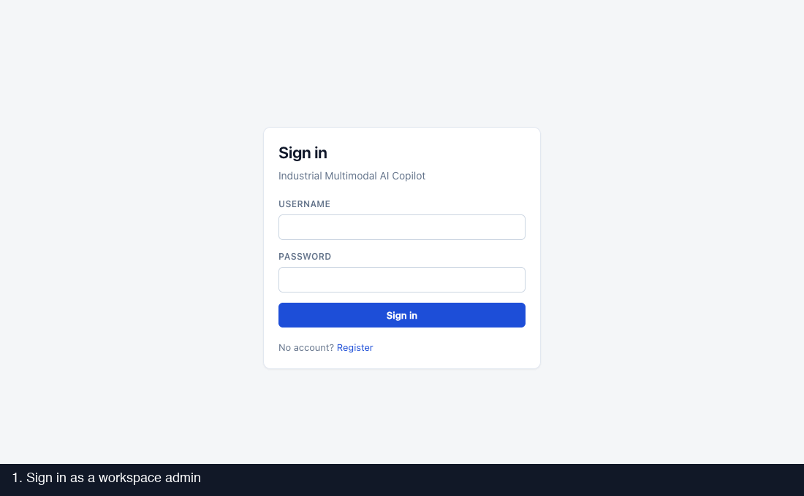

# Industrial Multimodal AI Copilot

[](https://github.com/nithya-prakash/IndustrialAICopilot/actions/workflows/ci.yml)

[](LICENSE)

Diagnosis assistant for manufacturing maintenance teams: a technician asks about a machine, optionally adds a
photo and sensor readings, and gets a diagnosis with citations to the equipment manual. Low-confidence or
high-severity results are held for a supervisor to approve.



## Why

Plain RAG chatbots answer from whatever they retrieve. On a plant floor a wrong answer has a cost, so here the
agent must gather evidence first (manuals, sensor history, image analysis, maintenance records), any citation it
makes is checked against what it actually retrieved, and anything uncertain goes to a human before it is acted on.

## Key results

| Metric | Result | Dataset and method |
|---|---|---|
| Retrieval MRR, hybrid + rerank | 0.886 (dense-only scored 0.929) | 7 hand-labelled questions, `python -m evaluation.retrieval_ablation` |
| RAGAS faithfulness / context precision | 1.00 / 0.91 | 7 questions on the sample manual; judge: local `qwen2.5:7b` |
| Diagnosis latency, supervisor graph | 8.5 s on Groq `gpt-oss-120b`; about 155 s on local `qwen2.5:7b` | one question, same manual |
| API latency under load | health avg 11 ms; diagnoses list avg 24 ms, p99 160 ms; 0 failures in 95 requests | Locust, 5 users, 45 s, local Docker; AI endpoints excluded |
| Injection screen, attacks caught | regex 8/20, llm-guard 15/20, both 18/20 | 20 synthetic attacks; false positives 4/22, 2/22, 6/22 on 22 benign texts |

All sets are small and self-written: they check that the pipeline works and show relative differences, not general
accuracy. Reproduce with the scripts in `evaluation/` and `loadtest/`.

## Architecture


```mermaid
flowchart LR
    User(["Technician / Supervisor"]) --> FE["React SPA"]
    FE -- "REST + JWT" --> API["FastAPI"]
    API --> PG[("PostgreSQL")]
    API --> QD[("Qdrant")]
    API -- enqueue --> RD[("Redis")] --> WK["Celery worker<br/>extract, chunk, embed"]
    API --> AG["Diagnosis agent<br/>tool loop or LangGraph supervisor"]
    AG -- "8 tools" --> TL["manual search · sensors · image<br/>maintenance · past incidents · report"]
    TL --> PG & QD
    AG --> LLM[["Anthropic / Groq / Ollama"]]
    AG --> AP["Supervisor approval + audit log"]
    API -- "/metrics" --> PR["Prometheus + Grafana"]
```

- **Hybrid retrieval:** Qdrant dense search plus BM25, fused with Reciprocal Rank Fusion and a cross-encoder reranker.
- **Agent:** a tool-calling loop, or a LangGraph supervisor with document, sensor, vision and history specialists. Citations
  are validated against gathered evidence; confidence and severity are computed outside the model.
- **Human oversight:** the graph pauses with `interrupt()` for low-confidence or high-severity results; every decision is
  written to an append-only audit log, and all queries are tenant-scoped.
- **Incident memory:** a tool retrieves earlier diagnoses that a supervisor approved, by meaning (same workspace only),
  and treats them as background; they never raise the confidence score.
- **MCP server:** the same tools are available to any MCP client (`app/mcp_server/`).
- **Evaluation and observability:** RAGAS scores exported to Langfuse, Prometheus and Grafana for the API.

## Quickstart

```bash
git clone https://github.com/nithya-prakash/IndustrialAICopilot.git && cd IndustrialAICopilot
cp .env.example .env        # choose a provider: Anthropic key, Groq key (LLM_PROVIDER=groq) or local Ollama
docker compose up --build
```

Open http://localhost:3002 and create a workspace (you become its admin). API docs: http://localhost:8000/docs.

Share a live demo from your own machine: `deploy/demo-tunnel.sh` starts a single-container build (all services, seeded
demo workspace; logins `demo_technician` / `demo_supervisor`, password `Demo-Copilot-2026`) behind a free Cloudflare
tunnel and prints a public URL. It works only while your machine and Docker are running, and `deploy/demo-tunnel.sh stop` ends it.

## Tech stack

FastAPI, LangGraph, SQLAlchemy, PostgreSQL, Qdrant, Celery, Redis, sentence-transformers, React, TypeScript,
RAGAS, Langfuse, llm-guard, MCP, Prometheus, Grafana, Locust, Docker Compose, GitHub Actions, pytest.

## Limitations

- The Anthropic path is covered by mocked tests only (no credits were available). Live runs used Groq
  `gpt-oss-120b` and local Ollama models; Gemini is wired the same way but has not been called.
- Evaluation sets are tiny (7 questions, 20 attacks), and a 7B model judged a 7B model in the RAGAS run.
- Free-text sensor findings are not validated, and a small local vision model gave shallow image observations.
- Incident memory is checked on one live scenario (approve a diagnosis, then re-diagnose the same fault: the earlier
  incident was retrieved on both paths). It embeds up to the 200 most recent approved incidents per workspace on each
  call, which suits hundreds of incidents, not a large history.
- Paused approvals use in-memory graph checkpoints, so a restart drops the pause (the database record remains).
- No permanent hosted instance: Hugging Face now charges for Docker Spaces, so the demo is a single container shared on
  demand through a tunnel (`deploy/`).

<details>
<summary>Repo layout, tests and more detail</summary>

- `app/`: FastAPI app (`agents/`, `rag/`, `tools/`, `vision/`, `mcp_server/`, `guardrails.py`); `frontend/`: React SPA;
  `evaluation/`: retrieval, RAGAS and injection evaluations; `loadtest/`: Locust; `observability/`: Prometheus and Grafana.
- Tests: `pytest` (backend), run in CI together with `ruff` and the frontend build.
- Full notes, design decisions and the earlier detailed README: [`docs/detailed-notes.md`](docs/detailed-notes.md),
  [`docs/architecture-decisions.md`](docs/architecture-decisions.md), [`docs/security.md`](docs/security.md),
  [`docs/usage-guide.md`](docs/usage-guide.md).

</details>
