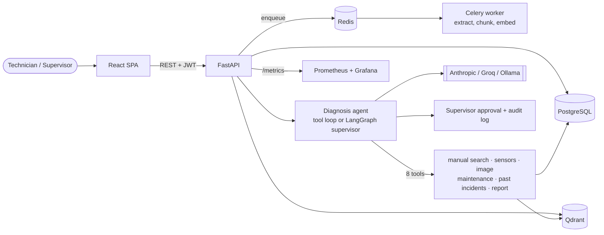

# Industrial Multimodal AI Copilot

[](https://github.com/nithya-prakash/IndustrialAICopilot/actions/workflows/ci.yml)

[](LICENSE)

Diagnosis assistant for manufacturing maintenance teams: a technician asks about a machine, optionally adds a
photo and sensor readings, and gets a diagnosis with citations to the equipment manual. Low-confidence or
high-severity results are held for a supervisor to approve.


## Why

Plain RAG chatbots answer from whatever they retrieve. On a plant floor a wrong answer has a cost, so here the
agent must gather evidence first (manuals, sensor history, image analysis, maintenance records), any citation it
makes is checked against what it actually retrieved, and anything uncertain goes to a human before it is acted on.

## Key results

| Metric | Result | Dataset and method |
|---|---|---|
| Retrieval MRR (recall@1) | BM25 0.939 (0.906), dense 0.903 (0.849), hybrid 0.953 (0.925), hybrid + rerank 0.950 (0.943) | 53 labelled questions over 4 manuals (45 chunks; 3 are synthetic), `python -m evaluation.retrieval_ablation` |
| RAGAS faithfulness / context precision | 1.00 / 0.91 | 7 questions on the sample manual; judge: local `qwen2.5:7b` |
| Answer quality, tool-loop agent | fact coverage 0.91, citation precision 0.91, overconfident on 2/8 unanswerable questions, unsupported numbers in 1/24 answers | 24 questions (16 answerable, 8 not) on the sample manual, Groq `gpt-oss-20b`, deterministic scoring (`python -m evaluation.answer_eval`); relevance cut-off -4.0 at the time; without it, overconfident on 3/3 unanswerable questions (a different model, `gpt-oss-120b`). The cut-off is now -1.15, set on a tuning split; re-run pending |
| Relevance cut-off, held-out check | -1.15: 4/5 answerable questions pass, 1/2 unanswerable blocked (balanced accuracy 0.65; perfect on the tuning questions) | 17 tuning / 7 held-out questions, retrieval scores only (`python -m evaluation.calibrate_cutoff`); far too small to be conclusive |
| Diagnosis latency, supervisor graph | 8.5 s on Groq `gpt-oss-120b`; about 155 s on local `qwen2.5:7b` | one question, same manual |
| API latency under load | read endpoints: p50 10 ms, p95 23 ms, 0 failures in 1,284 requests (14.9 req/s offered); login p50 2.3 s | Locust, 20 users, 90 s, local Docker, rate limits raised |
| AI endpoints, 2 concurrent users | 2 of 4 diagnoses completed; failures: 1 provider rate limit, 1 empty model answer (now retried) | Locust, Groq free tier; tiny sample, bounded by the provider |
| Injection screens (116 attacks, 105 benign texts) | regex 50/116 caught (95% CI 35-52%), 4/105 false positives; llm-guard 93/116 (72-86%), 14/105 false positives (8-21%); both 101/116, 18/105 | synthetic template attacks (seed 7) vs. 44 real manual passages, 46 tricky and 15 German benign sentences, `python -m evaluation.injection_eval --llm-guard` |

All sets are small and self-written: they check that the pipeline works and show relative differences, not general
accuracy. Reproduce with the scripts in `evaluation/` and `loadtest/`.

## Architecture


```mermaid
flowchart LR
    User(["Technician / Supervisor"]) --> FE["React SPA"]
    FE -- "REST + JWT" --> API["FastAPI"]
    API --> PG[("PostgreSQL")]
    API --> QD[("Qdrant")]
    API -- enqueue --> RD[("Redis")] --> WK["Celery worker<br/>extract, chunk, embed"]
    API --> AG["Diagnosis agent<br/>tool loop or LangGraph supervisor"]
    AG -- "8 tools" --> TL["manual search · sensors · image<br/>maintenance · past incidents · report"]
    TL --> PG & QD
    AG --> LLM[["Anthropic / Groq / Ollama"]]
    AG --> AP["Supervisor approval + audit log"]
    API -- "/metrics" --> PR["Prometheus + Grafana"]
```

- **Hybrid retrieval:** Qdrant dense search plus BM25, fused with Reciprocal Rank Fusion and a cross-encoder reranker.
- **Agent:** a tool-calling loop, or a LangGraph supervisor with document, sensor, vision and history specialists. Citations
  are validated against gathered evidence; confidence and severity are computed outside the model.
- **Human oversight:** the graph pauses with `interrupt()` for low-confidence or high-severity results; every decision is
  written to an append-only audit log, and all queries are tenant-scoped.
- **Incident memory:** a tool retrieves earlier diagnoses that a supervisor approved, by meaning (same workspace only),
  and treats them as background; they never raise the confidence score.
- **MCP server:** the same tools are available to any MCP client as an authenticated, audited, rate-limited service
  account ([`docs/mcp.md`](docs/mcp.md)).
- **Evaluation and observability:** RAGAS scores exported to Langfuse, Prometheus and Grafana for the API.

## Quickstart

```bash
git clone https://github.com/nithya-prakash/IndustrialAICopilot.git && cd IndustrialAICopilot
cp .env.example .env        # choose a provider: Anthropic key, Groq key (LLM_PROVIDER=groq) or local Ollama
docker compose up --build
```

Open http://localhost:3002 and create a workspace (you become its admin). API docs: http://localhost:8000/docs.

**Windows:** install [Docker Desktop](https://www.docker.com/products/docker-desktop/) (WSL 2 backend, at least 6 GB RAM
for Docker) and Git, then in PowerShell: `git clone https://github.com/nithya-prakash/IndustrialAICopilot.git`,
`cd IndustrialAICopilot`, `copy .env.example .env`, `docker compose up --build`, and open http://localhost:3002.
Line endings are pinned to LF by `.gitattributes`. The `deploy/*.sh` helpers need Git Bash or WSL. Developed and tested
on macOS; the Windows path is expected to work through Docker but has not been run on Windows.

Share a live demo from your own machine: `deploy/demo-tunnel.sh` starts a single-container build (all services, seeded
demo workspace; logins `demo_technician` / `demo_supervisor`, password `Demo-Copilot-2026`) behind a free Cloudflare
tunnel and prints a public URL. It works only while your machine and Docker are running, and `deploy/demo-tunnel.sh stop` ends it.

## Tech stack

FastAPI, LangGraph, SQLAlchemy, PostgreSQL, Qdrant, Celery, Redis, sentence-transformers, React, TypeScript,
RAGAS, Langfuse, llm-guard, MCP, Prometheus, Grafana, Locust, Docker Compose, GitHub Actions, pytest.

## Security and guardrails

- **Injection:** retrieved text is screened (regex, optionally llm-guard) and flagged in the diagnosis; tool output is
  treated as data. llm-guard catches far more (80% vs 43%) but flags 8 of 15 German benign sentences (none of the 44 real
  manual passages). Both barely detect citation-forging and confidence-manipulation attacks, which is why those are
  handled structurally: citations are checked against retrieved evidence and confidence is computed outside the model.
- **Tool inputs:** every tool call is validated centrally (required and unknown keys, types, lengths, UUIDs, ISO times).
- **Evidence:** citations are checked against what was retrieved, passages below a calibrated relevance score are dropped,
  and confidence is computed outside the model.
- **Unsafe actions:** recommendations that bypass safety devices, skip lockout, exceed ratings or ignore alarms are
  replaced with a safe fallback and force supervisor approval (rule-based; it cannot judge advice in general).
- **Access:** tenant-scoped queries, role-gated approval where nobody approves their own diagnosis, append-only audit
  log, and an authenticated, rate-limited MCP service account ([`docs/mcp.md`](docs/mcp.md)).

## Why this architecture

- **A supervisor with specialists** (documents, sensors, vision, history, maintenance planner) keeps each step's tools
  and prompt small, and every step observable. The older single tool-loop agent is kept: it is faster and simpler for
  easy questions.
- **Hybrid retrieval plus a cross-encoder**, because manuals mix exact terms (part names, limits) with paraphrased
  symptoms. On 53 questions hybrid beats each method alone, but only by 0.01 to 0.05 MRR, which is within noise for
  that sample, and the questions were written from the same manual text, which favours keyword matching. The earlier
  7-question run had dense-only ahead. A large independent corpus is still needed to settle it.
- **Approval as a graph `interrupt()` stored in Postgres** so a pending decision survives restarts and the model
  never acts on its own output.
- **Everything behind one provider switch** (`LLM_PROVIDER`), so the same evaluation runs on a hosted or local model.

Sample request and a real response: [`docs/sample-input.md`](docs/sample-input.md).

## Limitations

- The Anthropic path is covered by mocked tests only (no credits were available). Live runs used Groq
  `gpt-oss-120b` and local Ollama models; Gemini is wired the same way but has not been called.
- Evaluation sets are tiny (24 to 53 questions, 116 synthetic attacks), the relevance cut-off generalizes only modestly to held-out questions (7 of them),, and a 7B model judged a 7B model in the RAGAS run.
- Free-text sensor findings are not validated, and a small local vision model gave shallow image observations.
- Incident memory is checked on one live scenario (approve a diagnosis, then re-diagnose the same fault: the earlier
  incident was retrieved on both paths). It embeds up to the 200 most recent approved incidents per workspace on each
  call, which suits hundreds of incidents, not a large history.
- Paused approvals are checkpointed in Postgres (verified: pause, restart the backend, resume from a new process).
  Only the graph's checkpoint format is tied to the installed LangGraph version.
- No permanent hosted instance: Hugging Face now charges for Docker Spaces, so the demo is a single container shared on
  demand through a tunnel (`deploy/`).

<details>
<summary>Repo layout, tests and more detail</summary>

- `app/`: FastAPI app (`agents/`, `rag/`, `tools/`, `vision/`, `mcp_server/`, `guardrails.py`); `frontend/`: React SPA;
  `evaluation/`: retrieval, RAGAS and injection evaluations; `loadtest/`: Locust; `observability/`: Prometheus and Grafana.
- Tests: `pytest` (backend), run in CI together with `ruff` and the frontend build.
- Full notes, design decisions and the earlier detailed README: [`docs/detailed-notes.md`](docs/detailed-notes.md),
  [`docs/architecture-decisions.md`](docs/architecture-decisions.md), [`docs/security.md`](docs/security.md),
  [`docs/usage-guide.md`](docs/usage-guide.md).

</details>
